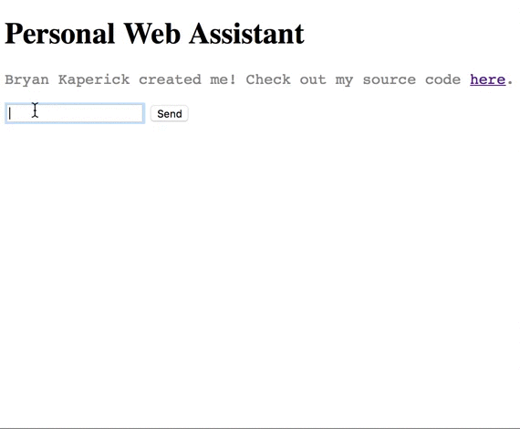

A Web-based chat app which responds to basic informational queries.

Current dependencies include the most recent versions of:
* Node.js
* Socket.io
* jQuery

Two free APIs are currently utilized.  You need to create accounts at
* [Open Weather Map](http://www.openweathermap.org)
* [Google Custom Search Engine](http://www.google.com/cse)

Store the API keys in config.json mapping "weatherKey" and "googleKey" to the strings.

The queries that currently return answers are:
* Any variation of asking about what time it is
* Any variation of asking about the weather, as long as the query ends in "in CITY?"
* Any variation of asking for info[rmation] about a topic, as long as the query ends in the desired topic.  To search multiple words, delimit the words with +.  For example:
    * "Can you tell me some info about foxes?"
    * "Do you have any information about Bryan+Kaperick?"

**DISCLAIMER:** The initial Socket.io framework is based on the tutorial "http://www.programwitherik.com/getting-started-with-socket-io-node-js-and-express/".  All the commenting and external API functionality is mine, so I take full responsibility for incorrect terminology and overall bad style in those sections.  Don't blame Erik for that!
